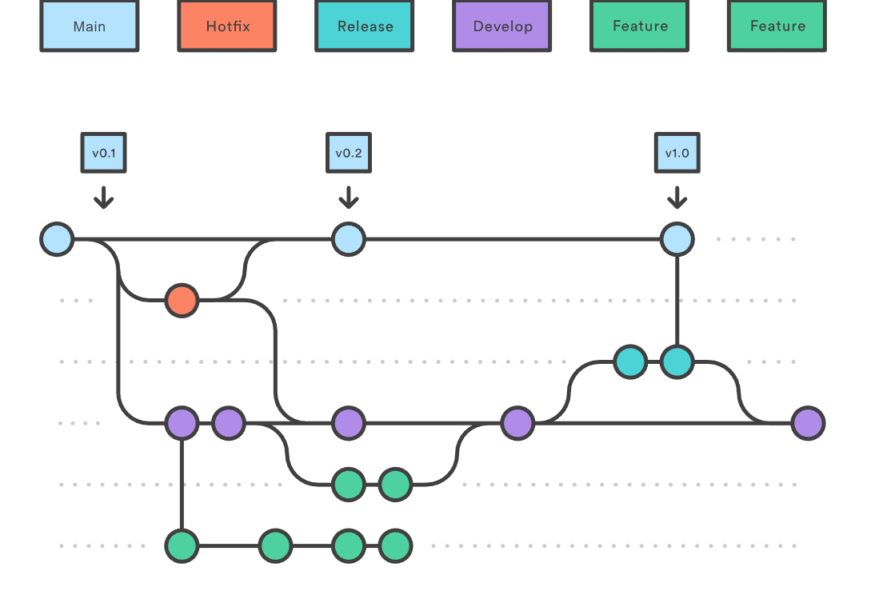
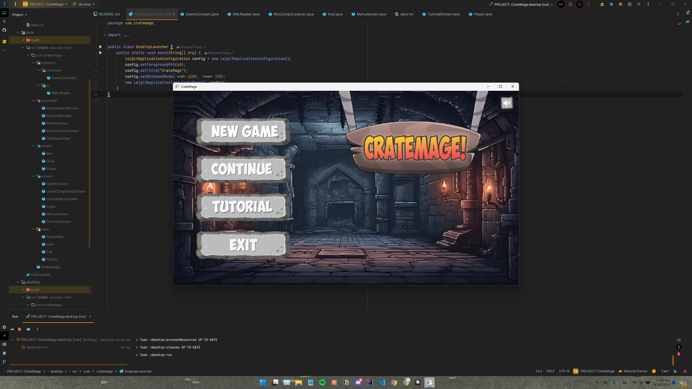
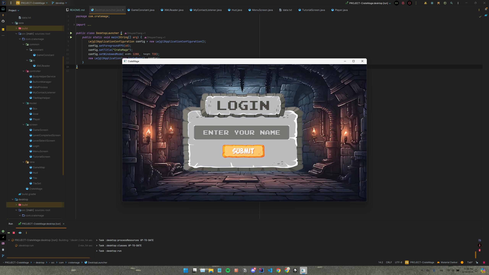
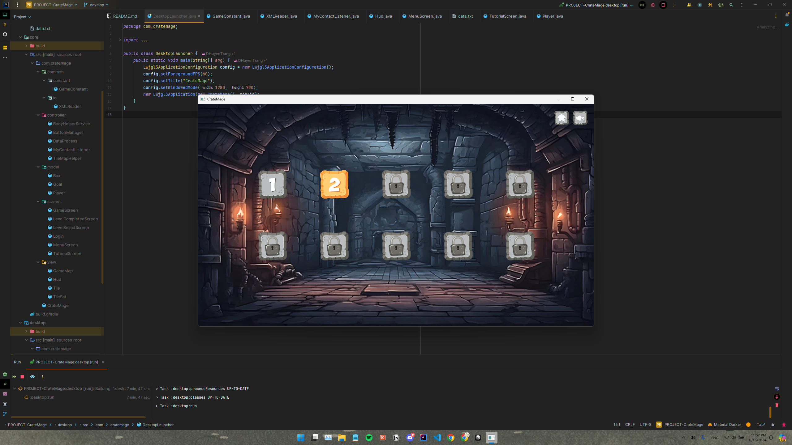
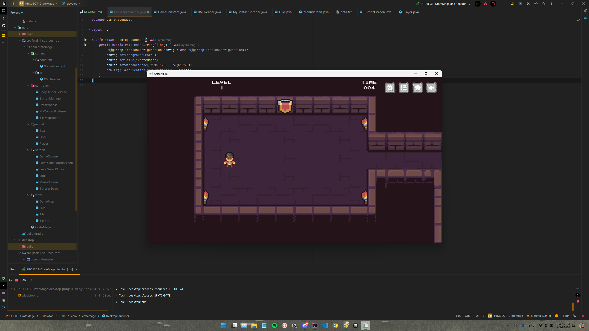
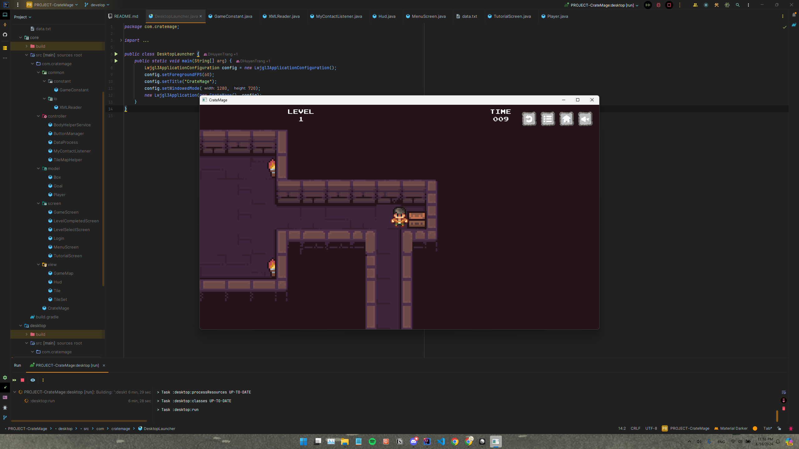
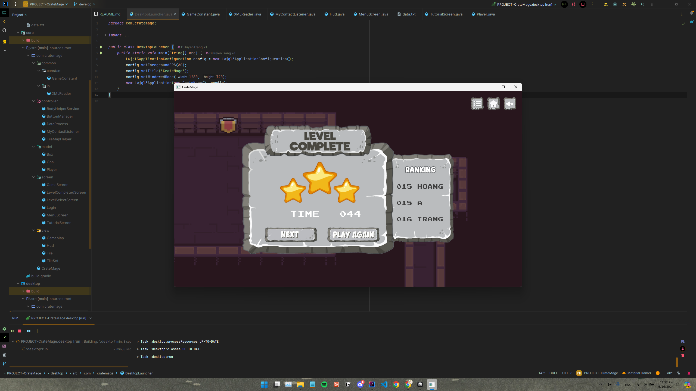

# CrateMage - ProGameCup

> ProGameCup is a competition hosted by ProPTIT. After OOP Course for club member in ProPTIT, we will have a competition to test our knowledge and skills. This competition is a good chance for us to improve our coding skills and learn from each other.

## 1. Group Information

**Project Name:** Crate Mage

**Project Link:** [GitHub Link](https://github.com/littlepsyduck/PROJECT-CrateMage)

**Members:**
- [Nguyễn Bá Việt Hoàng](https://github.com/littlepsyduck)
- [Hoàng Trung Hiếu](https://github.com/jinjja9)
- [Đặng Huyền Trang](https://github.com/DHuyenTrang)

**Mentors:**
- [Nguyễn Quốc Hưng](https://github.com/quochung-cyou)
- [Nguyễn Đăng Minh](https://github.com/monkeydminh49)

### Working Model

Team operates using the Scrum model and utilizes Linear to manage tasks. All tasks are meticulously tracked on Linear.
- Tracking: [Linear Link](https://linear.app/bdtproptit/team/NHOM4/all)

Each week, team meets to review completed work, collaboratively solve issues, and propose solutions for the upcoming week. This is followed by a demo session with the mentor to receive feedback and guidance.

### Version Control Strategy

Team uses Gitflow to manage code. Each member creates a branch from `develop` for their work, naming the branches using the format `feature/feature-name`. Upon completion, a Pull Request is created for code review and then merged into `develop`.
- Main branches:
    - `main`: Contains stable code that has been thoroughly tested and reviewed.
    - `develop`: Contains the latest code that has passed review and testing.
    - `feature/`: Branches that contain ongoing development work, which are short-lived and merged into `develop` upon completion.



At the end of each week, team merges `develop` into `main` to release a new version.


## 2. Project Introduction

> **Description:** Crate Mage is an engaging and strategic puzzle game where players take on the role of a powerful mage who manipulates crates to overcome obstacles, solve intricate puzzles, and defeat enemies. The game combines elements of classic block-pushing puzzles with magical abilities, creating a unique and challenging gameplay experience.

## 3. Main Features

- **Level Progression:** Advance through increasingly difficult levels, each designed with unique challenges and requiring innovative solutions.
- **Puzzle Mechanics:** Players must manipulate crates to navigate through levels and reach goals.
- **Time Clock:** A stopwatch will be activated at the start of the level and show the time when the player reaches goal.
- **Speed Ranking:** A ranking based on shortest completion time will appear each time the player completes a level. 

## 4. Technology

### 4.1. Technologies Used
- **Programming Language:** Java
- **Framework:** libGDX
- **Graphics:** Adobe Photoshop and Adobe Illustrator
- **Sound:** Adobe Premiere Pro for sound editing
- **Version Control:** Git with GitHub for repository hosting

### 4.2 Project Structure

```
- assets 
  - button
  - character
  - levelSelect
  - login
  - map
  - menu
  - levelPass
  - sounds
  - tutorial
- core
  - common
  - view
  - model
  - controller
  - screen
  - CrateMage(main)
- desktop
  - DesktopLauncher
...
```

Explanation:
- **assets:** Contains resources like images and sounds.
- **core:**  Contains the main classes of the game, such as model, view, and controller.
- **desktop:** Contains platform-specific classes for running the game on different platforms.


## 5. Demo Images and Videos

**Demo Images:**














**Demo Videos:**
[Video Link](https://youtu.be/t-C7L7eXr1I)


## 6. Issues Encountered

### Issue 1: Difficulty working in groups with Git

### Actions Taken to Resolve

**Solution:** Team members learn how to use Git on their own, leading to conflicts and misunderstandings at several steps.
- Discuss with the whole team to resolve conflicts and become more proficient in Git.

### Result

- After the first 1 or 2 weeks, which were quite clumsy, Git and GitHub followed a more consistent flow.

### Issue 2: Handles interactions between character and crates

### Actions Taken to Resolve

**Solution:** The game cannot be played in a horizontal perspective, so gravity cannot be placed top-down.
- Implement the MyContactListener class to handle collisions between character and crates.

### Result

- There was an error where the crate was pushed and couldn't stop, but it was later fixed.

## Issue 3: Handles interactions between crates 

### Actions Taken to Resolve

**Solution:** The group had difficulty determining the event of selecting 2 crates so that they could then control the two crates to move together.
- The group tried to research and ask for advice from mentors.

### Result

- The problem has not been fixed. But our team came up with an alternative solution that doesn't need to use the mouse click event.
- We will number the crates and display them so players can press the key to select the two crates they want to link.

## 7. Conclusion

**Achieved Results:** 
- The game has completed most of the basic functions, and can operate normally.
- This is also our group's first product, and also our first group product, so it may not be complete yet. 

**Future Development Direction:** 
- There are still some features that can be improved, such as interaction between crates.
- Some traps and interacts with doors as well as with other crates.
